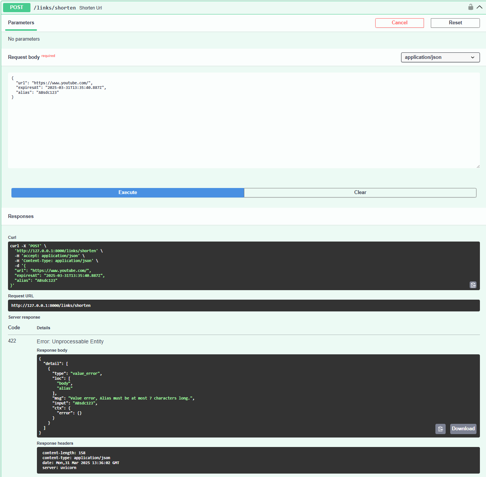
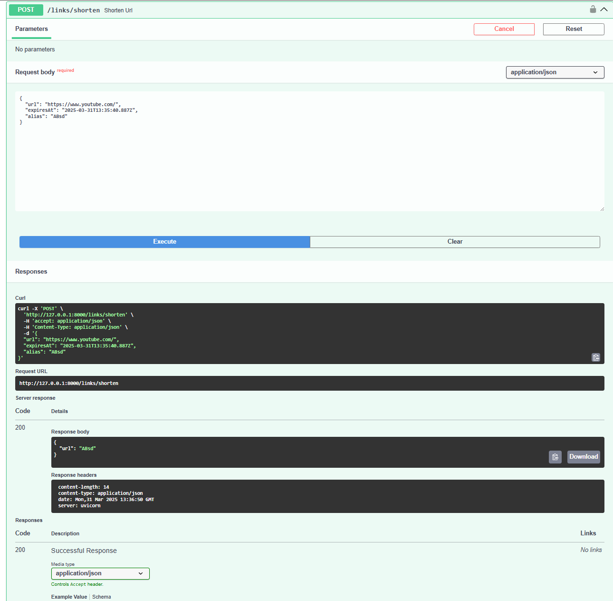
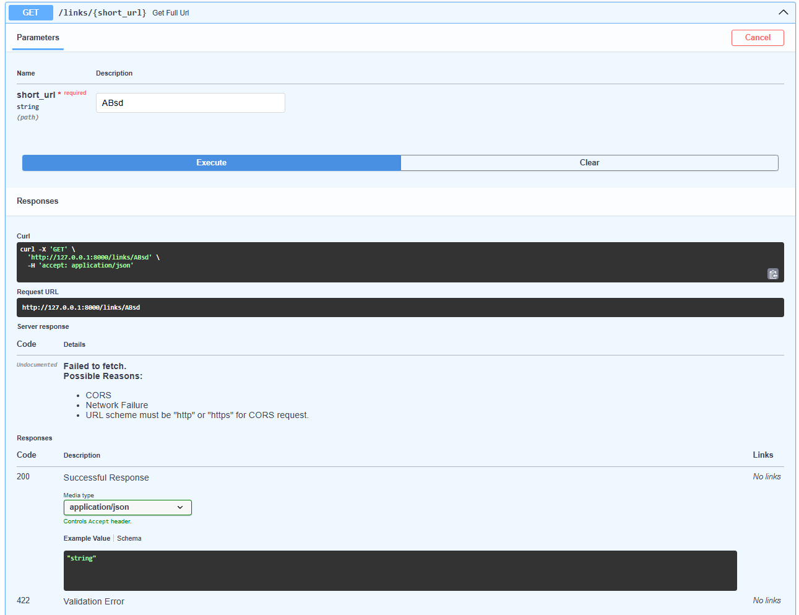
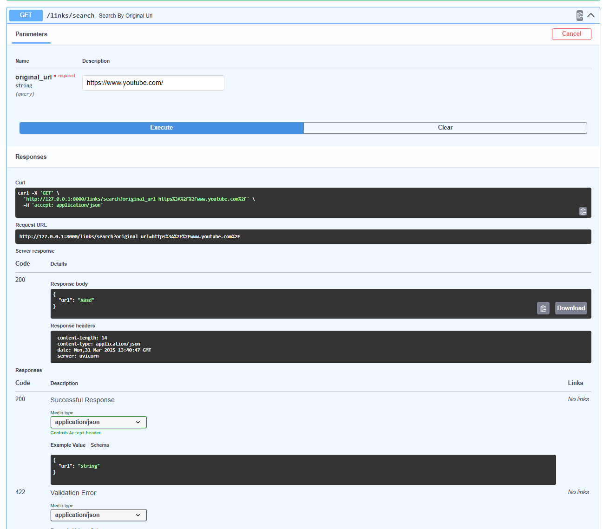
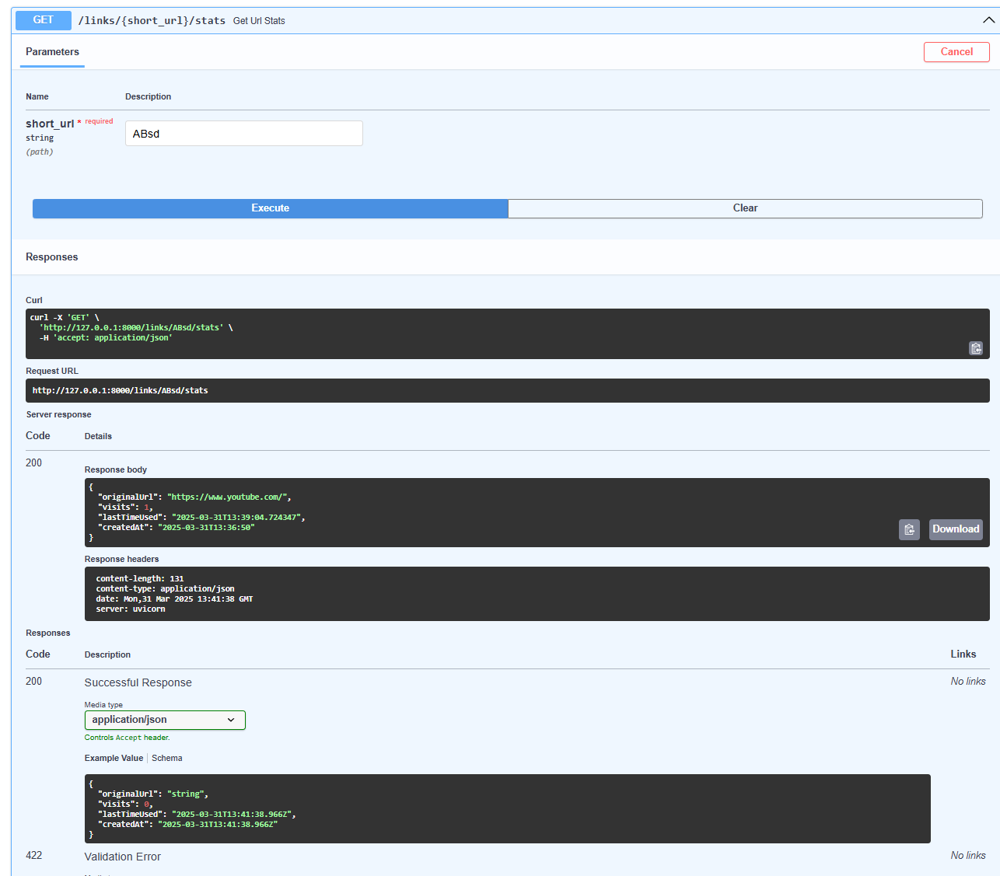
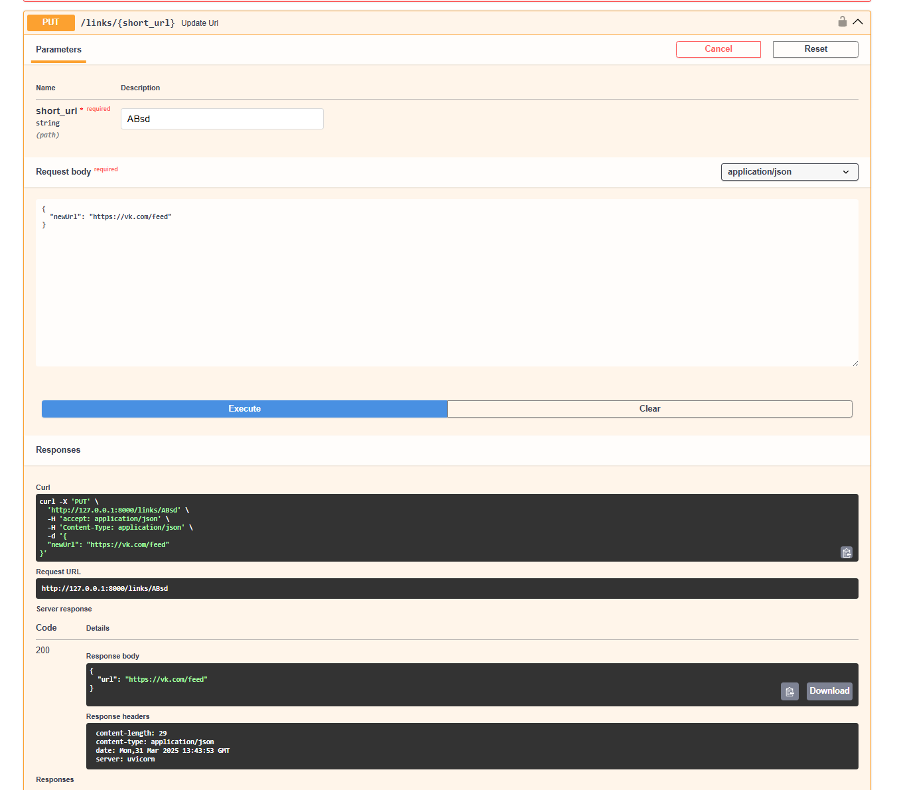
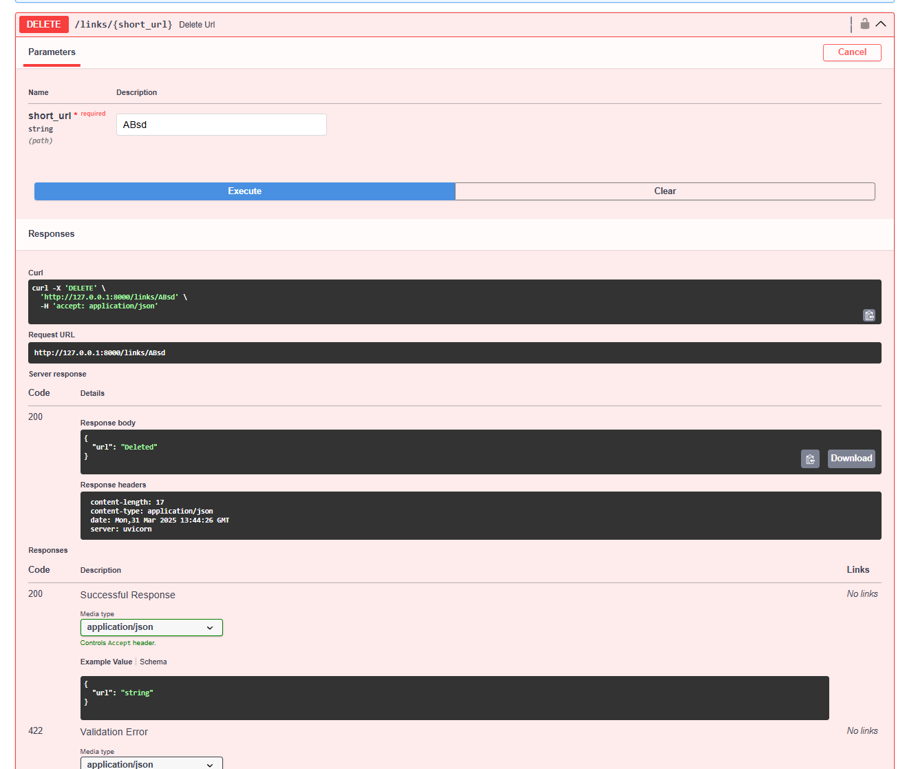
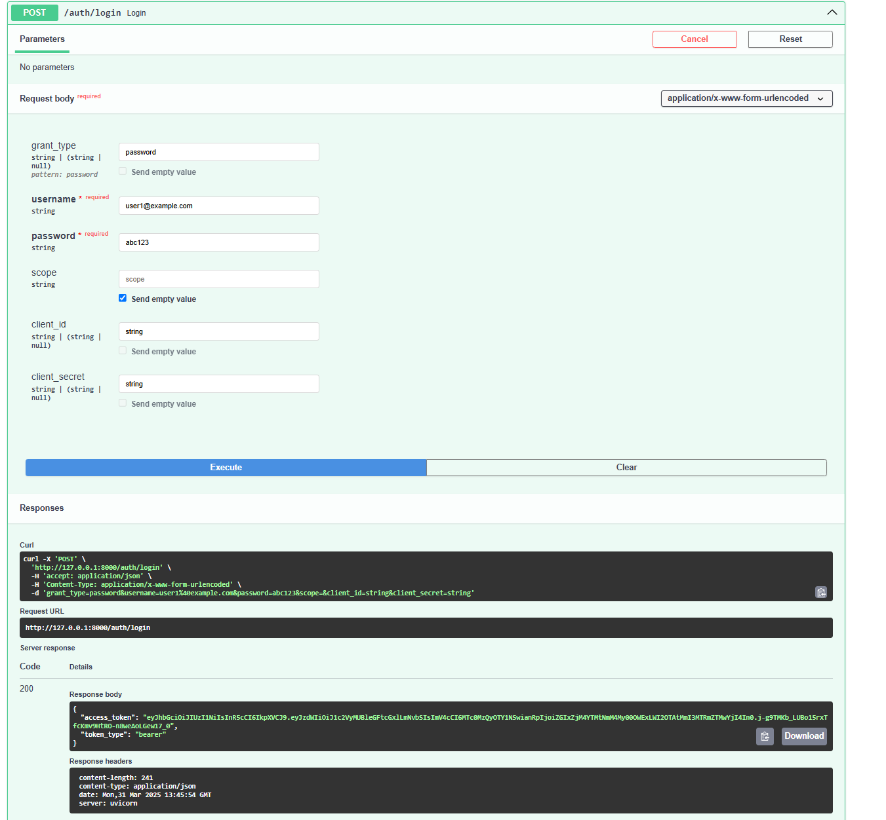
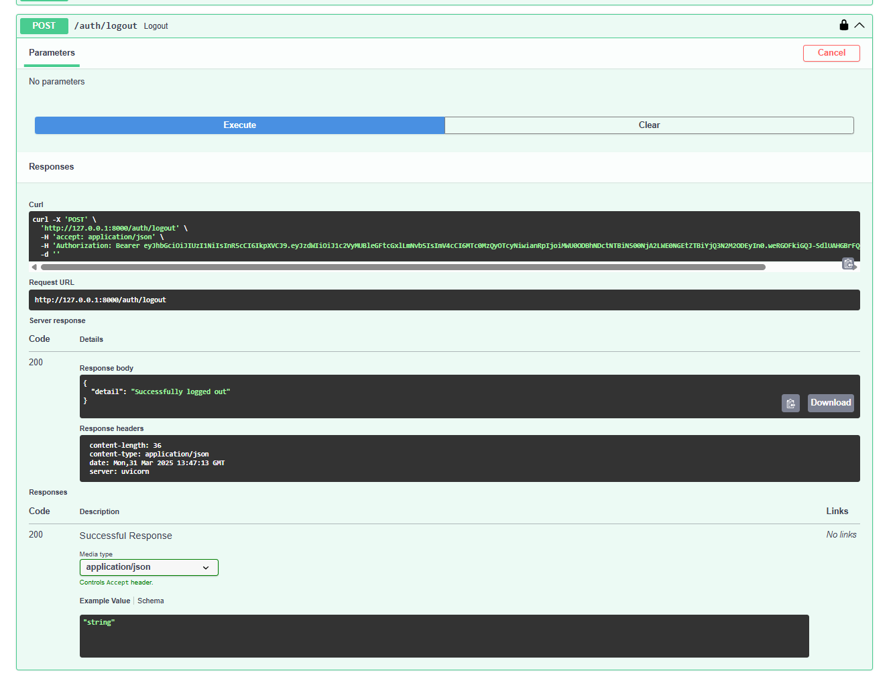

# url_shortner
Yakunin Ivan HW3


Сервис для сокращения длинных ссылок с поддержкой регистрации пользователей, аналитики переходов, ограниченного времени жизни ссылок и кэширования.

---

## Описание API

Сервис предоставляет REST API для управления короткими ссылками. Основные возможности:

- Создание коротких ссылок (`POST /links/shorten`) (Работает полностью для зарегистрированных пользователей и ограничено по времени для незарегистрированных)
- Переход по короткой ссылке (`GET /links/{short_code}`)
- Удаление короткой ссылки (`DELETE /links/{short_code}`)
- Обновление ссылки (`PUT /links/{short_code}`)
- Получение статистики (`GET /links/{short_code}/stats`)
- Поиск по оригинальной ссылке (`GET /links/search?original_url=...`)
- Регистрация и аутентификация пользователей (`/auth/register`, `/auth/login`, `/auth/logout`)
- Автоматическая очистка просроченных и неиспользуемых ссылок (фоновая задача)
- Дополнительные Admin функции (сейчас открыте для всех) для просмотра баз данных


## Примеры запросов

### Пример создания короткой ссылки





### Переход по короткой ссылке


### Переход по полной ссылке



### Получение статистики по короткой ссылки


### Изменение полной ссылки для короткой


### Удалеине короткой ссылки



### Регистрация нового пользователя


### Вход в существующий аккаунт


### Выход из аккаунта



## Схема базы данных

### `urls` — таблица коротких ссылок

| Поле           | Тип данных         | Описание                                                               |
|----------------|--------------------|------------------------------------------------------------------------|
| `id`           | Integer            | Первичный ключ                                                         |
| `short_url`    | String             | Уникальный короткий код (алиас) ссылки                                 |
| `long_url`     | String             | Исходная длинная ссылка                                                |
| `times_visited`| Integer            | Количество переходов по ссылке (по умолчанию 0)                        |
| `created_at`   | DateTime           | Дата и время создания ссылки (по умолчанию `now()`)                    |
| `last_visited` | DateTime           | Дата последнего перехода (по умолчанию `now()`)                        |
| `expires_at`   | DateTime (nullable)| Дата истечения срока действия ссылки                                   |
| `owner_id`     | Integer (nullable) | ID пользователя-владельца ссылки (внешний ключ на `users.id`)          |

---

### `users` — таблица пользователей

| Поле           | Тип данных | Описание                                                                |
|----------------|------------|-------------------------------------------------------------------------|
| `id`           | Integer    | Первичный ключ                                                          |
| `email`        | String     | Email пользователя (уникальный, индексированный)                        |
| `password_hash`| String     | Хеш пароля пользователя                                                 |
| `is_active`    | Boolean    | Флаг активности пользователя (по умолчанию `True`)                      |
| `created_at`   | DateTime   | Дата регистрации (по умолчанию `now()`)                                 |

---

### `expired_urls` — таблица удалённых/просроченных ссылок

| Поле           | Тип данных         | Описание                                                                |
|----------------|--------------------|-------------------------------------------------------------------------|
| `id`           | Integer            | Первичный ключ                                                          |
| `shortUrl`     | String             | Короткая ссылка                                                         |
| `longUrl`      | String             | Исходная длинная ссылка                                                 |
| `timesVisited` | Integer            | Количество переходов по ссылке (по умолчанию 0)                         |
| `createdAt`    | DateTime           | Дата создания                                                           |
| `lastVisited`  | DateTime (nullable)| Дата последнего перехода                                                |
| `expiresAt`    | DateTime (nullable)| Дата истечения срока действия                                           |
| `deletedAt`    | DateTime           | Дата удаления (по умолчанию `now()`)                                    |
| `owner_id`     | Integer (nullable) | ID владельца (если был)                                                 |


## Инструкция по запуску (через Docker)

Выполни команду:
```bash
docker-compose up --build
```

## Инструкция по запуску (через Python)

```bash
pip install -r requirements.txt
redis-server
uvicorn main:app --reload
```
